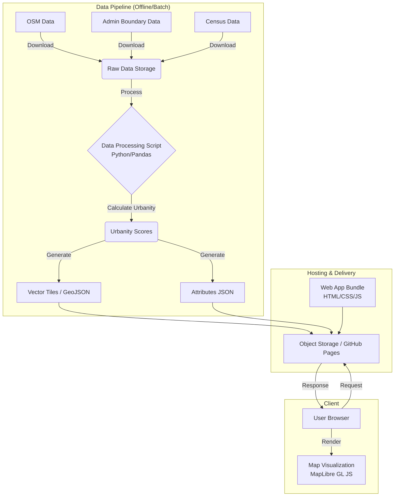

# システム設計書

## 1. システムアーキテクチャ概要
本システムは、事前計算された静的データ（GeoJSON/MVT）を配信する**Static Site Architecture**を採用する。
バックエンドサーバーは存在せず、データ処理パイプライン（ETL）によって生成された静的ファイルを、CDN経由でクライアント（ブラウザ）に配信する。

### 構成図

## 2. データモデル

### 2.1 都会度データ (Urbanity Score)
各市町村（またはメッシュ）に対して算出されるスコア。
最終的な出力は、市町村コードをキーとしたJSON、および地図表示用のベクトルタイルに含まれる属性データとなる。

| フィールド名 | 型 | 説明 |
| :--- | :--- | :--- |
| `region_code` | String | 全国地方公共団体コード (JIS X 0402) |
| `region_name` | String | 市町村名 |
| `total_score` | Float | 総合都会度スコア (0-100) |
| `cvs_score` | Float | コンビニ指標スコア |
| `super_score` | Float | スーパー指標スコア |
| `restaurant_score` | Float | 飲食店指標スコア |
| `population_density` | Float | 人口密度 |

### 2.2 地理空間データ
- **行政区域ポリゴン**: 国土数値情報（行政区域）を使用。
- **軽量化**: ブラウザでの描画負荷を下げるため、TopoJSONへの変換や、Mapbox Vector Tiles (MVT) 形式への変換を行う。ズームレベルに応じた間引き（Simplification）を適用する。

## 3. 技術スタック詳細

### 3.1 データ処理 (ETL)
- **言語**: Python 3.10+
- **ライブラリ**:
    - `pandas`, `geopandas`: データフレーム処理、空間結合
    - `osmnx`: OpenStreetMapからのデータ取得
    - `scikit-learn`: スコアの正規化、クラスタリング（必要に応じて）
    - `tippecanoe` (CLIツール): GeoJSONからベクトルタイル(MVT)への変換

### 3.2 フロントエンド
- **フレームワーク**: React (Vite)
- **言語**: TypeScript
- **地図ライブラリ**: MapLibre GL JS (オープンソース、Mapbox互換)
- **UIコンポーネント**: Tailwind CSS (スタイリング)
- **状態管理**: React Hooks / Context API

### 3.3 ホスティング・デプロイ
- **ソースコード管理**: GitHub
- **CI/CD**: GitHub Actions (データ更新バッチの実行、サイトのビルド・デプロイ)
- **ホスティング**: GitHub Pages (初期段階), 必要に応じて Vercel や AWS S3 + CloudFront

## 4. データ更新フロー
1. **Trigger**: 定期実行（cron）または手動トリガー。
2. **Fetch**: OSM APIおよび政府統計窓口(e-Stat)APIから最新データを取得。
3. **Calculate**:
    - 各市町村ポリゴンと店舗ポイントデータの空間結合（Spatial Join）。
    - 密度計算、距離計算、スコアリング。
4. **Build**:
    - フロントエンドアプリケーションのビルド。
    - 地図タイルの生成。
5. **Deploy**: 静的ホスティング環境へアップロード。

## 5. 拡張性への考慮
- **メッシュ化への対応**: 現在は市町村単位だが、データ処理ロジックをメッシュ単位（地域メッシュ統計）に変更することで、より詳細なヒートマップ表示へ移行可能な設計とする。
- **スコアロジックの調整**: 重み付け係数を設定ファイル（config）として分離し、ロジック変更を容易にする。
