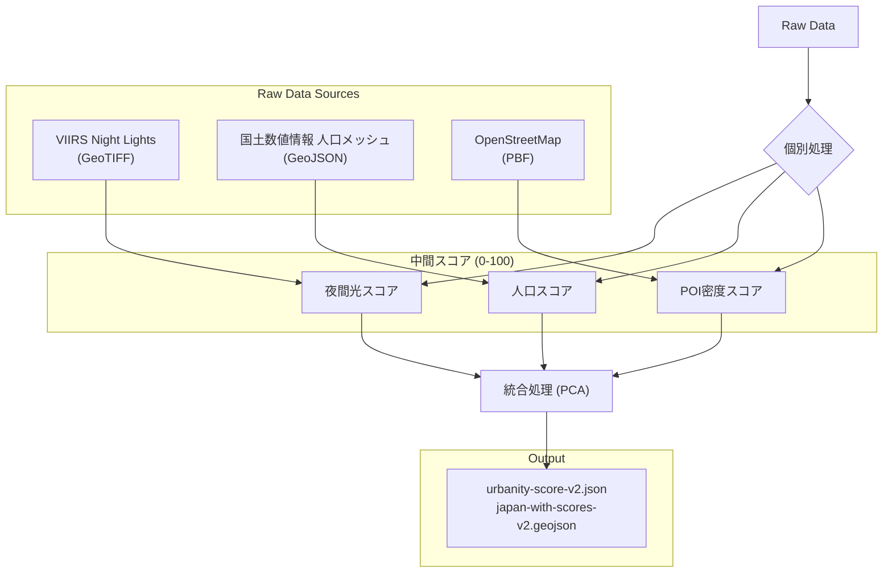

# 都会度データ算出アルゴリズム

本ドキュメントでは、Rawデータから「都会度スコア (Urbanity Score)」を算出するまでの処理フローとアルゴリズムについて解説します。

## 全体概要

都会度スコアは、以下の3つの独立した指標を算出し、それらを主成分分析（PCA）を用いて統合することで生成されます。

1.  **夜間光 (Night Lights)**: 衛星データによる地上の明るさ
2.  **人口 (Population)**: 国土数値情報の人口メッシュデータ
3.  **POI (Points of Interest)**: 飲食店やコンビニなどの店舗密度

これらを市区町村ごとに集計・スコア化し、最終的に0〜100の「都会度スコア」として算出します。

---

## 1. 個別スコアの算出

各指標の算出ロジックは共通の正規化手法を用いています。

### 正規化ロジック (共通)
各指標のRaw値は分布が大きく偏っている（都市部と地方部で桁が異なる）ため、対数変換を行ってから0-100に正規化しています。

$$ Score = \frac{\log_{10}(x + 1) - \min}{\max - \min} \times 100 $$

*   $x$: Raw値（平均放射輝度、総人口、店舗密度）
*   $\log_{10}(x+1)$: 0値の対数エラーを防ぐための補正付き対数変換
*   Min-Max Scaling: 全自治体の中での相対位置を0-100で表現

---

### A. 夜間光スコアプロセス (`process_night_lights.py`)

*   **データソース**: VIIRS Annual Composite (GeoTIFF)
*   **処理単位**: 市区町村ポリゴンごとの平均値 (Zonal Statistics)
*   **算出値**: 平均放射輝度 (Average Radiance)
*   **目的**: 都市の物理的な明るさ、エネルギー消費量を反映

### B. 人口スコアプロセス (`process_population.py`)

*   **データソース**: 国土数値情報 500mメッシュ人口推計 (GeoJSON/JSON)
*   **処理方法**:
    1.  人口メッシュの重心点を作成
    2.  市区町村ポリゴンと空間結合 (Spatial Join)
    3.  市区町村内のメッシュ人口を合計
*   **算出値**: 市区町村内の総人口
*   **目的**: 人の居住密度、都市の規模を反映

### C. POI密度スコアプロセス (`process_poi.py`)

*   **データソース**: OpenStreetMap (OSM) PBFデータ
*   **抽出対象**:
    *   `shop`: `convenience`, `supermarket`
    *   `amenity`: `restaurant`, `cafe`, `fast_food`, `bar`, `pub`, `izakaya`
*   **処理方法**:
    1.  対象タグを持つノードを抽出
    2.  市区町村ポリゴンと空間結合
    3.  市区町村ごとの店舗数を集計
    4.  市区町村の面積($km^2$)で割って密度を算出
*   **算出値**: 店舗密度 (店舗数 / $km^2$)
*   **目的**: 商業的な活気、利便性を反映

---

## 2. 統合スコアの算出 (`integrate_scores.py`)

3つのスコア（夜間光、人口、POI）を統合して、一つの「都会度」指標を作成します。単純平均ではなく、データの分散を最もよく説明できる軸を抽出するために**主成分分析 (Principal Component Analysis - PCA)** を使用しています。

### 手順

1.  **入力**: 各指標の正規化済みスコア (0-100)
2.  **前処理**: 再度対数変換 ($\log(1+x)$) を適用し、分布の偏りをさらに緩和
3.  **標準化**: 平均0、分散1にデータをスケーリング (`StandardScaler`)
4.  **PCA実行**: 第1主成分（最も情報のばらつきが大きい軸）を抽出
5.  **重み付け**: 第1主成分への寄与度（Eigenvectors）に基づいて、各指標の重要度が決定されます。
    *   *結果例: 夜間光:人口:POI = 0.33 : 0.34 : 0.33 (概ね均等に評価される傾向)*
6.  **最終正規化**: PCAスコアを再度 0-100 の範囲に Min-Max 正規化

### 出力ファイル

*   `urbanity-score-v2.json`: 各市区町村コードをキーとしたスコアデータ
*   `japan-with-scores-v2.geojson`: 地図表示用。GeoJSONの各Featureにスコアを埋め込んだもの。

## まとめ

このアルゴリズムの特徴は、**「明るさ」「人の数」「商業密度」という異なる3つの次元から多角的に「都会」を定義している点**にあります。PCAを用いることで、人為的な重み付け（例：人口を2倍にする等）を排除し、データ自身の構造から自然な「都会度」の軸を導き出しています。
