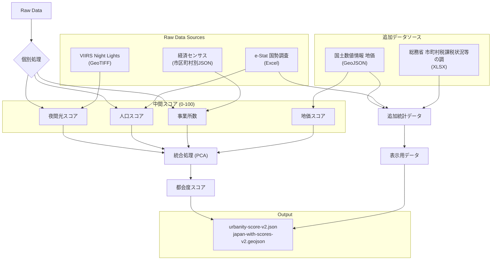

# 都会度データ算出アルゴリズム

本ドキュメントでは、Rawデータから「都会度スコア (Urbanity Score)」を算出するまでの処理フローとアルゴリズムについて解説します。

## 全体概要

都会度スコアは、以下の4つの独立した指標を算出し、それらを主成分分析（PCA）を用いて統合することで生成されます。

1.  **夜間光 (Night Lights)**: 衛星データによる地上の明るさ
2.  **人口 (Population)**: 国勢調査の公式データ
3.  **事業所数 (Establishments)**: 経済センサスの市区町村別事業所数
4.  **地価 (Land Price)**: 国土数値情報の地価公示データ

これらを市区町村ごとに集計・スコア化し、最終的に0〜100の「都会度スコア」として算出します。

また、都会度スコアとは別に、以下の**追加統計データ**も表示用に収集しています：
- 平均所得、人口増加率、高齢者割合

```mermaid
graph TD
    A[Raw Data] --> B{個別処理}
    B --> C[夜間光スコア]
    B --> D[人口スコア]
    B --> E[事業所数]
    C & D & E & P --> F["統合処理 (PCA)"]
    F --> G[都会度スコア]

    H[追加統計データ] --> I[表示用データ]
    G --> J[最終成果物]
    I --> J

    subgraph "Raw Data Sources"
        R1["VIIRS Night Lights<br>(GeoTIFF)"]
        R3["経済センサス<br>(市区町村別JSON)"]
        S1["e-Stat 国勢調査<br>(Excel)"]
    end

    subgraph "追加データソース"
        S1
        S2["国土数値情報 地価<br>(GeoJSON)"]
        S3["総務省 市町村税課税状況等の調<br>(XLSX)"]
    end

    subgraph "中間スコア (0-100)"
        C
        D
        E
        P[地価スコア]
    end

    subgraph "Output"
        J[urbanity-score-v2.json<br>japan-with-scores-v2.geojson]
    end

    R1 --> C
    S1 --> D
    R3 --> E
    S2 --> P
    S2 --> H
    S1 --> H
    S3 --> H
```

---

## 1. 個別スコアの算出

各指標の算出ロジックは共通の正規化手法を用いています。

### 夜間光・人口の正規化
対数値を0-100に変換します。上下限は2020年版の値を基準ファイル `scripts/urbanity-calibration-v2.json` に固定し、データ更新のたびに計算し直しません。基準範囲を外れた値は0または100で止めます。

*   夜間光: $\log_{10}(\max(平均放射輝度, 0.001) + 1)$ を2020年の範囲で正規化
*   人口: $\log_{10}(\max(人口, 1))$ を2020年の範囲で正規化
*   事業所数と地価: 生データに $\log(1+x)$ を適用し、保存済みの2020年標準化係数で統合

---

### A. 夜間光スコアプロセス (`process_night_lights.py`)

*   **データソース**: VIIRS Annual Composite (GeoTIFF)
*   **処理単位**: 市区町村ポリゴンごとの平均値 (Zonal Statistics)
*   **算出値**: 平均放射輝度 (Average Radiance)
*   **目的**: 都市の物理的な明るさ、エネルギー消費量を反映
*   **基準**: 2020年市区町村境界で求めた対数値の範囲を固定して使用

### B. 人口スコアプロセス (`process_population.py`)

*   **データソース**: e-Stat 令和7年国勢調査 人口等基本集計 表1-1 (`census2025_table_1-1.xlsx`)
*   **処理方法**:
    1.  Excelの項目名から「人口・男女総数」を特定して抽出
    2.  2025年市区町村コードと行政区域境界の共通コードに限定
    3.  市区町村コード（5桁）に基づいて対数スコア化
*   **算出値**: 市区町村内の総人口
*   **目的**: 都市の規模を最も正確に反映
*   **基準**: 2020年人口の対数値の範囲を固定して使用。2025年の最大・最小人口に合わせてスコアを再尺度化しない

### C. POI密度スコアプロセス (`process_poi.py`)

このスクリプトは補助的なPOIデータを生成します。現行の`integrate_scores.py`のPCA入力には含めず、経済センサスの事業所数を使います。

*   **データソース**: OpenStreetMap (OSM) PBFデータ
*   **抽出対象**:
    *   `shop`: `convenience`, `supermarket`
    *   `amenity`: `restaurant`, `cafe`, `fast_food`, `bar`, `pub`, `izakaya`
*   **処理方法**:
    1.  対象タグを持つノードを抽出
    2.  市区町村ポリゴンと空間結合
    3.  市区町村ごとの店舗数を集計
    4.  市区町村の面積($km^2$)で割って密度を算出
    *   **算出値**: 店舗密度 (店舗数 / $km^2$)
*   **目的**: 商業的な活気、利便性を反映

---

## 2. 追加統計データ

都会度スコアの算出には使用しませんが、UI表示用に以下の統計データを収集しています。

### D. 人口統計データ (`process_demographics.py`)

*   **データソース**:
    - e-Stat 令和7年国勢調査 人口等基本集計 表1-1
    - e-Stat 令和7年国勢調査 人口等基本集計 表2-7
*   **算出値**:
    - **人口増加率 (pop_growth)**: 2020年→2025年の5年間の公式人口増減率 (%)
    - **高齢者割合 (elderly_ratio)**: 表2-7の65歳以上人口 / 総人口 × 100 (%)
*   **目的**: 人口動態の傾向を表示

### E. 地価データ (`process_land_price.py`)

*   **データソース**: 国土数値情報 2026年地価公示 (`data/L01-26_GML/L01-26.geojson`)
*   **処理方法**: 標準地ポイントを市区町村境界に空間結合し、価格属性 `L01_008` の平均を算出
*   **算出値**: 平均公示地価 (円/㎡、2026年1月1日時点)
*   **目的**: 土地の経済的価値を表示

### F. 平均所得データ (`process_tax.py`)

*   **データソース**: 総務省「市町村税課税状況等の調」令和7年度 第11表 (`J51-25-b.xlsx`)
*   **処理方法**:
    1. 総所得金額等（千円）を所得割の納税義務者数で割り、1人当たり所得を算出
    2. 令和7年度調査の所得年は2024年
    3. 区ごとのデータが存在しない政令指定都市の場合、市のデータを用いて各区のデータを補完
*   **算出値**: 所得割納税義務者1人当たりの総所得金額等 (万円)。課税対象所得や給与年収とは異なる
*   **目的**: 住民の経済力を表示

---

## 3. 統合スコアの算出 (`integrate_scores.py`)

4つのスコア（夜間光、人口、経済センサス事業所数、地価）を統合して、一つの「都会度」指標を作成します。単純平均ではなく、データの分散を最もよく説明できる軸を抽出するために**主成分分析 (Principal Component Analysis - PCA)** を使用しています。

### 手順

1.  **入力**: 各指標の正規化済みスコア・実数値
2.  **前処理**: 対数変換 ($\log(1+x)$) を適用し、分布の偏りを緩和
3.  **標準化**: 2020年版で保存した平均・標準偏差を使う
4.  **PCA実行**: 2020年版で保存した第一主成分を適用。更新時にPCAを再学習しない
5.  **重み付け**: 夜間光:人口:事業所数:地価 = 0.28 : 0.27 : 0.16 : 0.29
6.  **最終正規化**: PCAスコアを2020年版の範囲で0-100にし、固定した非線形補正を適用

このため、2025年に人口が減っても、別の自治体の人口が最大になったことだけで人口スコアや都会度の物差しが動くことはありません。2020年の既存スコアを同じ処理で再現できることを確認したうえで、2025年値を同じ基準に当てはめます。スケールの意味を変更するときだけ、基準ファイルを意図的に更新します。

### 出力ファイル

*   `urbanity-score-v2.json`: 各市区町村コードをキーとしたスコアデータ。以下のフィールドを含む:
    - `urbanity`: 都会度スコア (0-100)
    - `light_pollution`: 光害スコア (0-100)
    - `population_count`: 人口
    - `establishment_count`: 経済センサス事業所数
    - `land_price`: 平均公示地価
    - `avg_income`: 所得割納税義務者1人当たりの総所得金額等
    - `pop_growth`: 人口増加率 (%)
    - `elderly_ratio`: 高齢者割合 (%)
*   `japan-with-scores-v2.geojson`: 地図表示用。GeoJSONの各Featureにスコアを埋め込んだもの。

---

## まとめ

このアルゴリズムは、**「明るさ」「人口」「事業所数」「地価」の4指標から「都会」を定義**します。PCAを用いることで、人為的な重み付けを避け、入力データの分散に応じた合成軸を導き出します。

さらに、人口動態（増加率・高齢化率）や経済指標（地価・所得）などの追加統計も収集することで、単なる都会度だけでなく、各市区町村の多角的な特徴を把握できるようになっています。
